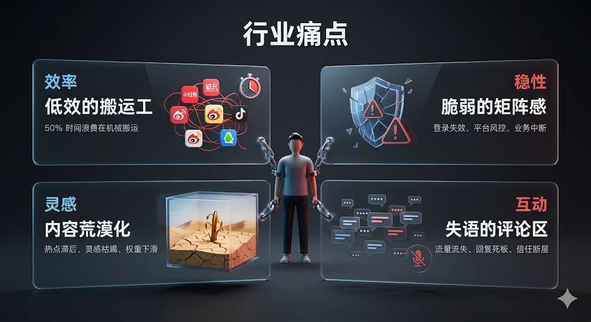
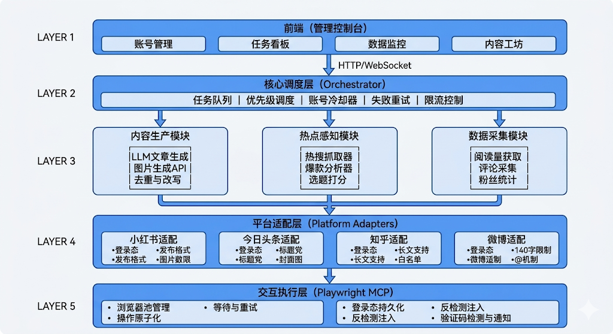
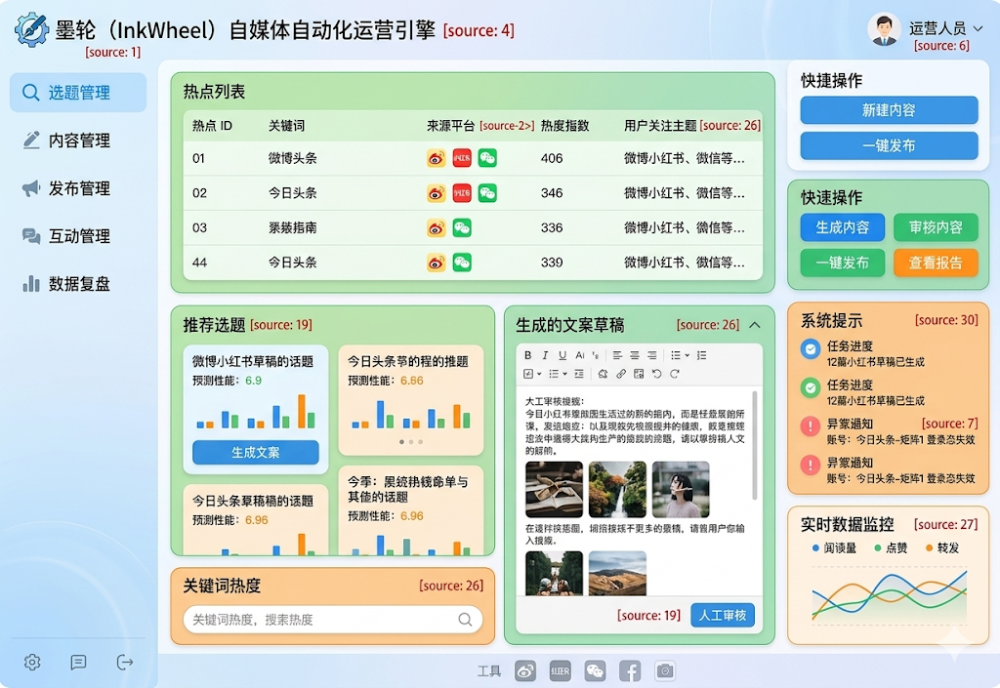

# InkWheel（墨轮）

> 一个能自己找热点、自己写文章、自己配图、自己发布到多个平台、自己看数据的 AI 运营员工。
> 本项目基于 **CyberLab ContentOps** 实验型控制台实现，采用 FastAPI + React/Vite 架构。

在流量碎片化的今天，创作已不再是唯一的挑战，运营体力活正成为扼杀创作者热情的元凶。墨轮 (InkWheel) 是一款基于 AI Agent 技术的自媒体自动化运营引擎。我们将传统创作的“笔墨”与工业级的“齿轮”精准耦合，通过模块化工作流，将创作者从枯燥的搬运、排版、分发中彻底解放，实现一人即是矩阵，内容即刻全网。

---

## 一、行业现状



- **低效的搬运工**：50% 的运营时间浪费在多平台切换、格式调整与点击“发布”按钮上。
- **脆弱的矩阵感**：想要全网布局，却因账号登录态频繁失效、平台风控更新而导致业务中断。
- **内容荒漠化**：追热点慢、灵感枯竭，导致无法维持高频次输出，账号权重逐渐下滑。
- **失语的评论区**：流量来了却接不住，用户评论无人回复或回复模板化，既浪费互动数据，也错失二次曝光与信任转化的机会。

---

## 二、核心功能

### 模块 1：账号管理

| 功能 | 说明 | 用户操作 |
| --- | --- | --- |
| 账号添加 | 支持小红书、今日头条、知乎、微博等平台账号 | 前端填写账号备注 + 扫码/密码登录 |
| 登录态持久化 | 保存 Cookie/Session，下次无需重复登录 | 自动完成，前端显示“已登录”状态 |
| 账号分组 | 将多个账号分组管理（如“科技号组”“生活号组”） | 创建分组、拖拽账号到分组 |
| 登录态检测 | 每天自动检测账号是否过期 | 前端显示“有效/失效/需重新登录” |
| 多账号切换 | 同一平台多个账号轮换使用 | 发布时可选择用哪个账号 |
| 账号健康度 | 记录限流、违规、删文情况 | 前端显示健康分（0-100）及告警 |

### 模块 2：内容生产

| 功能 | 说明 | 用户操作 |
| --- | --- | --- |
| AI 生成文章 | 输入关键词/选题，LLM 自动生成正文 | 输入选题 → 选择风格 → 点击生成 → 预览/编辑 |
| 平台风格适配 | 同一篇文章自动适配不同平台风格 | 选择目标平台，系统自动改写 |
| AI 配图生成 | 根据文章内容生成配图（单图/多图） | 点击“生成配图” → 选择图片（可替换） |
| 内容去重检测 | 检测内容是否近期发布过，避免重复 | 自动提示“该主题 7 天内已发布过” |
| 敏感词过滤 | 自动检测并替换政治/色情/广告违规词 | 系统自动处理，高亮提示用户确认 |
| 手动编辑 | 支持人工修改 AI 生成的内容 | 富文本编辑器直接修改 |
| 内容库 | 保存已生成的文章，供后续复用 | 保存/加载草稿、搜索历史内容 |

### 模块 3：热点感知与选题

| 功能 | 说明 | 用户操作 |
| --- | --- | --- |
| 热搜榜抓取 | 定时抓取各平台热搜榜（微博/抖音/知乎/头条） | 设置抓取频率（默认每小时） |
| 领域过滤 | 只抓取指定领域的热点（如科技、财经、娱乐） | 设置关键词白名单 |
| 爆款分析 | 分析同领域高互动内容的特点 | 自动输出分析报告 |
| 选题打分 | 对抓取的热点进行热度评分（0-100） | 前端展示评分，可手动调整 |
| 选题库 | 将高分选题存入库中，待生产内容 | 查看选题列表 → 选择“生成内容” |
| 定时选题 | 设置每天固定时间自动选题并入内容队列 | 设置定时策略（如每天 9 点选题） |

### 模块 4：多平台发布

| 功能 | 说明 | 用户操作 |
| --- | --- | --- |
| 单平台发布 | 将内容发布到指定平台的指定账号 | 选择内容 + 选择平台账号 → 立即发布 |
| 多平台联动 | 一键发布到多个平台（自动适配格式） | 选择内容 + 勾选多个平台 → 发布 |
| 定时发布 | 设置未来时间自动发布 | 设置日期时间 → 加入发布队列 |
| 发布队列 | 管理待发布任务（优先级、状态、重试） | 查看队列、取消任务、手动重试失败任务 |
| 延时同步 | 首发平台发布后，延迟指定时间再发其他平台 | 设置延迟策略（如首发后 24 小时） |
| 发布预览 | 发布前模拟显示在各平台的效果 | 点击预览 → 显示平台样式预览 |
| 批量发布 | 多条内容批量发布到多个账号 | 勾选多条内容 + 多个账号 → 批量发布 |

### 模块 5：数据监控

| 功能 | 说明 | 用户操作 |
| --- | --- | --- |
| 流量数据 | 获取阅读量、展示量、点击率 | 前端图表展示（折线图/柱状图） |
| 互动数据 | 获取点赞、评论、转发、收藏、粉丝增长 | 前端图表展示 + 明细列表 |
| 多平台汇总 | 各平台数据统一汇总对比 | 平台对比图表 |
| 爆款内容排行 | 按互动率/阅读量排序的 TOP 内容 | 排行榜列表 |
| 账号表现对比 | 同一平台多个账号的表现对比 | 并排图表对比 |
| 数据导出 | 导出指定时间段的数据报表 | 选择时间范围 → 导出 Excel/CSV |
| 异常告警 | 数据异常时告警（如互动量骤降） | 前端告警通知 + 可配置阈值 |

---

## 三、系统架构

前端是给运营人员用的管理控制台，在这里可以管理所有平台账号、查看内容发布状态、监控数据报表，整个操作界面直观易用，不需要技术背景也能上手。

调度层是整个系统的指挥中心，负责把任务拆解排序、控制执行节奏。当某个任务失败时自动重试，当某个账号发布太频繁时自动暂停冷却，确保整个系统稳定运行不触发平台风控。

能力模块是 AI 内容生产的核心，包含文章写作、图片生成、热点抓取和数据采集四个子模块。AI 会根据热点选题自动生成文章，配合去重改写确保原创度，同时持续采集已发布内容的数据反馈给 AI 持续优化。

平台适配层负责对接各个内容平台，每个平台的发布规则、格式要求、限制都不同，这里做统一的适配转换，让同一套内容能一键分发到小红书、微博、知乎、今日头条等不同平台。

执行层是真正操控浏览器完成操作的部分，通过模拟真人操作来发布内容，不依赖平台开放 API。这种方式更稳定可靠，能绕过平台对自动化工具的限制，同时配合反检测技术让操作看起来和真人一样。



### 前端功能清单



| 模块 | 功能点 |
| --- | --- |
| 账号管理 | 添加/删除账号、登录态状态（有效/失效）、平台选择、账号分组 |
| 任务看板 | 今日待发布、进行中、已完成、失败队列；支持手动创建任务 |
| 数据监控 | 各平台阅读/互动汇总折线图、TOP5 爆款内容、异常告警列表 |
| 内容工坊 | 手动输入选题 → AI 生成预览 → 修改 → 选择平台 → 立即/定时发布 |
| 系统设置 | LLM API Key、图片生成 API、代理池配置、各平台发布间隔 |

---

## 四、技术栈与项目结构

- **后端**：FastAPI + SQLite
- **前端**：React + Vite + TypeScript
- **AI 模型**：OpenCode 免费模型（可配置）
- **外部平台工具**：小红书 CDP、`toutiao_cli`、微信公众号 `wemp-operator`

```text
backend/     FastAPI API、服务、SQLite 持久化、平台适配器
frontend/    React 操作控制台
external/    克隆的第三方自动化仓库（今日头条、小红书、微信公众号）
docs/        需求分析、架构、部署使用、平台状态、审计等文档
```

---

## 五、快速开始

```bash
make install        # 安装后端/前端依赖
make backend-dev    # 后端 http://127.0.0.1:8000
# 另开终端
make frontend-dev   # 前端 http://127.0.0.1:5173
```

详细安装、配置、外部工具登录与使用说明见 [docs/install_deploy_usage.md](docs/install_deploy_usage.md)。

### 配置

复制环境变量模板并填入 OpenCode API key：

```bash
cp .env.example backend/.env
```

```text
OPENCODE_API_KEY=your-opencode-api-key
OPENCODE_BASE_URL=https://opencode.ai/zen/v1
OPENCODE_MODEL=mimo-v2.5-free
```

---

## 六、核心 API

| 方法 | 路径 | 说明 |
| --- | --- | --- |
| GET | `/api/status` | API 状态、适配器状态、OpenCode 可用性 |
| GET | `/api/dashboard` | 前端首屏聚合数据 |
| POST | `/api/trends/collect` | 公开榜单采集 |
| POST | `/api/rss/collect` | RSS 文章采集 |
| POST | `/api/content/analyze` | LLM 文章分析 |
| POST | `/api/content/generate` | 生成多平台草稿（支持 LLM/模板） |
| POST | `/api/publish/preview` | 生成平台预览载荷 |
| POST | `/api/publish/execute-preview` | 真实调用外部工具 preview/draft |
| GET/POST | `/api/external-repos` / `/api/external-repos/sync` | 外部仓库状态与同步 |
| GET | `/api/jobs` | 运行日志 |

---

## 七、测试

```bash
make test           # 后端 pytest + 前端 vitest
```

---

## 八、文档

- [需求分析](docs/requirements_analysis.md)
- [安装部署与使用手册](docs/install_deploy_usage.md)
- [系统架构](docs/architecture.md)
- [平台工具接入状态](docs/platform_status.md)
- [能力等级表](docs/capability_levels.md)
- [命令索引](docs/commands.md)
- [审计指标契约](docs/audit_metrics.md)
- [远程原始 InkWheel 产品 README 备份](docs/inkwheel-readme-origin.md)

---

## 九、技术重难点

| 问题 | 拟解决方案 | 设计依据 |
| --- | --- | --- |
| 多平台内容适配 | 为不同平台设计模板与提示词库 | 提高发布一致性与适配性 |
| 内容质量控制 | 增加人工审核、敏感词过滤、规则校验 | 保证内容可用与安全 |
| 热点选题准确性 | 结合热度、关键词、历史表现综合评分 | 提升选题有效性 |
| 评论互动处理 | 自动分类、摘要、回复建议生成人机协同 | 提升互动效率 |
| 数据复盘闭环 | 建立阅读、点赞、评论、转化指标看板 | 支撑运营优化 |
| 系统扩展与集成 | 模块化设计，接口适配层解耦 | 便于维护与扩展 |

---

## 十、安全说明

- 默认 preview/draft/manual-confirm 模式，不自动点击真实发布按钮。
- OpenCode API key、平台 Cookie、AppSecret 通过环境变量注入，不写入代码与 Git。
- 真实平台动作前需要本地登录态，并会在 UI 进行二次确认。
- 文档不得记录账号 Cookie、验证码、AppSecret、Access Token 或真实用户隐私数据。

---

## 十一、历史说明

本项目代码实现代号为 **CyberLab ContentOps**，是 InkWheel 产品概念的实验型实现。为统一仓库入口，已将远程原始 InkWheel 产品 README 与本地工程 README 合并，并将远程图片迁移至 `docs/images/`。远程原始 README 文本备份在 [docs/inkwheel-readme-origin.md](docs/inkwheel-readme-origin.md)。
