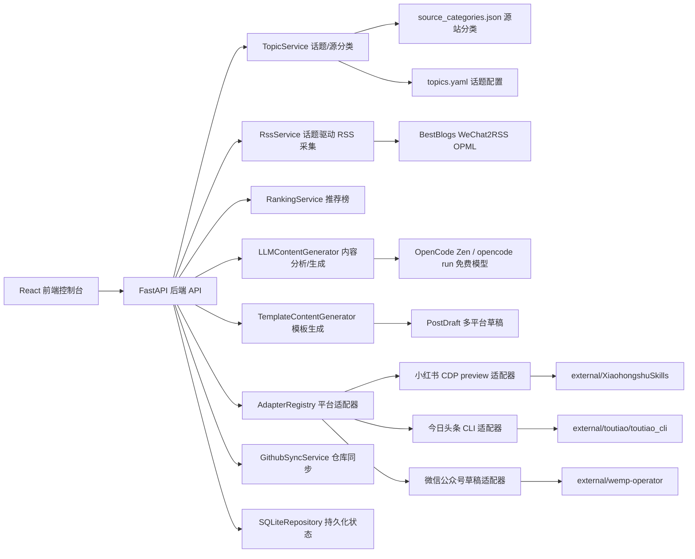

# 系统架构与维护指南

更新日期：2026-06-16

本文档用于说明 CyberLab ContentOps 当前架构、模块边界、依赖纪律、数据流、安全边界和审计关注点。它是伴随开发文档，每次新增平台、数据源、生成器、发布动作或接口契约时都应同步更新。

## 1. 当前定位

CyberLab ContentOps 是一个课程实验型内容运营控制台，用于演示以下链路：

1. 从公开榜单与 RSS 源采集互联网热点与优质文章。
2. 使用 OpenCode 免费模型对内容进行分析、摘要与多平台改写。
3. 为小红书、今日头条、微信公众号生成发布预览载荷。
4. 在 preview/draft/manual-confirm 模式下真实调用外部发布工具。
5. 在前端展示流程、状态、外部工具仓库同步状态和运行日志。
6. 使用 SQLite 持久化运行数据，为后续人工审核、实验报告和平台接入留下可追踪记录。

当前版本默认保持安全预览模式：后端不会自动点击真实平台的发布按钮；微信公众号草稿创建受 `WEMP_ALLOW_DRAFT` 开关控制。

## 2. 总体结构



## 3. 分层结构

CyberLab 不是一个“前端调几个脚本”的项目。它应保持清晰分层，所有依赖只能从上往下走：

```text
Layer 7 · 前端体验
  frontend/src/views/*
  frontend/src/components/*
  负责课程实验界面、状态展示和用户动作入口
        ↓
Layer 6 · API 合同
  backend/app/api/routes.py
  负责请求/响应模型、错误码和后端服务编排
        ↓
Layer 5 · 业务服务
  backend/app/services/topics.py
  backend/app/services/rss.py
  backend/app/services/ranking.py
  backend/app/services/content.py
  backend/app/services/adapters.py
  backend/app/services/github_sync.py
  负责话题与源分类、RSS 采集、推荐榜、内容生成、平台适配器分发和仓库同步
        ↓
Layer 4 · 内容生成器
  backend/app/services/llm.py
  backend/app/services/content.py
  负责模板生成与 OpenCode LLM 生成
        ↓
Layer 3 · 平台适配器
  backend/app/adapters/*
  负责把 PostDraft 转为平台 preview/draft/publish 载荷，并可真实调用外部工具
        ↓
Layer 2 · 数据模型与状态
  backend/app/models/schemas.py
  backend/app/storage/repository.py
  backend/app/storage/sqlite_repository.py
  负责领域对象、API schema、状态存储（默认 SQLite）
        ↓
Layer 1 · 外部工具边界
  external/XiaohongshuSkills
  external/toutiao
  external/wemp-operator
  只通过后端服务或适配器调用
        ↓
Layer 0 · 外部平台与互联网数据源
  小红书、今日头条、微信公众号、公开热点源站、WeChat2RSS
```

依赖纪律：

- 前端只调用后端 API，不拼接外部命令。
- API 只编排服务，不直接 import 外部平台脚本。
- 业务服务只通过适配器或明确的工具边界调用外部项目。
- 平台适配器不互相 import。
- 数据模型不依赖服务、适配器或前端。
- 外部项目作为 vendor/tool 处理，不把它们的内部模块散落 import 到业务层。

## 4. 后端模块边界

| 边界 | 当前实现 | 主要职责 | 审计重点 |
| --- | --- | --- | --- |
| API 路由 | `backend/app/api/routes.py` | 暴露状态、趋势、RSS、文章分析、内容生成、发布预览/执行、仓库同步和日志接口 | 请求体、响应体、错误码、是否触发外部副作用 |
| 趋势采集 | `backend/app/services/trends.py` | 调用热点采集脚本或返回备用热点 | 数据源、关键词、采集时间、失败原因、备用数据标记 |
| RSS 采集 | `backend/app/services/rss.py` | 解析 OPML、并发抓取 RSS、输出 ArticleItem | 源站列表、抓取结果数量、失败源站 |
| 内容生成 | `backend/app/services/content.py` | 模板生成三平台内容版本 | 生成输入、平台差异、模板版本、输出长度与标签 |
| LLM 服务 | `backend/app/services/llm.py` | 调用 OpenCode 进行文章分析与内容生成 | 模型名、提示词、token 使用、失败回退 |
| 平台适配器 | `backend/app/services/adapters.py` 与 `backend/app/adapters/*` | 将内容草稿转成平台载荷，并可真实调用外部工具 | 是否 preview-only、命令摘要、stdout/stderr、人工审核要求 |
| 仓库同步 | `backend/app/services/github_sync.py` | 检查并拉取 external 子项目的 GitHub 状态 | commit、dirty、commits_behind、pull 结果 |
| 状态存储 | `backend/app/storage/repository.py` + `sqlite_repository.py` | 默认 SQLite 持久化趋势、文章、草稿、日志 | 数据是否持久化、是否包含敏感信息 |
| 数据模型 | `backend/app/models/schemas.py` | 定义 API 与业务对象 | 字段命名、平台枚举、向后兼容性 |
| 异步任务 | `backend/app/services/jobs.py` | 内存异步任务存储、进度追踪、SSE 推送 | 任务状态、进度更新、回调泄漏、任务丢失风险 |

## 5. 趋势采集链路

当前 `TrendService` 接收 `CollectRequest`，包含源站列表、关键词和数量限制。它优先尝试调用：

```text
external/wemp-operator/scripts/content/fetch_news.py
```

采集结果会被规范化为 `TrendItem`，供前端榜单和内容生成模块使用。当外部采集不可用时，服务会返回确定性的备用热点，保证课程实验在离线或源站异常时仍然能继续。

审计时需要记录：

- 本次启用的数据源列表。
- 搜索关键词和 limit。
- 是否使用备用数据。
- 失败时的错误原因。
- 返回热点数量与主要标题。

## 6. 内容生成链路

`ContentService` 支持单资料生成与多资料融合生成。优先按用户开关决定是否调用 LLM：开启时通过 `OpencodeRunClient` 调用本地 `opencode run` 免费模型；关闭或 LLM 失败时回退到确定性模板。两种路径都通过 `ProgressTracker` 向 SSE 流推送进度。

融合生成接收 `article_ids` 与 `user_prompt`，LLM 路径会把多篇资料标题、摘要及用户创作意图一次性输入模型，输出 JSON 数组形式的三平台版本；模板路径则拼接资料要点并引用用户提示词。

生成结果为一个 `PostDraft`，其中包含不同平台的 `ContentVariant`：

| 平台 | 当前生成形态 | 后续扩展 |
| --- | --- | --- |
| 小红书 | 短标题、种草式正文、话题标签、配图提示词 | 接入图片生成、图文排版和预览截图 |
| 今日头条 | 微头条式摘要和讨论引导 | 接入 MCP/HTTP 发布预览桥 |
| 微信公众号 | 文章标题、摘要、Markdown 风格正文 | 接入草稿保存和素材上传 |

后续如接入 LLM，应增加 `ContentGenerator` 抽象，至少记录模型名称、提示词版本、输入热点、输出平台版本和人工修改记录。

## 7. 平台适配器链路

适配器统一实现预览契约：

```text
preview(post: PostDraft) -> AdapterPreview
```

当前适配器只返回预览载荷，不发布真实内容。返回内容包括：

- `platform`：平台标识。
- `ok`：预览是否可用。
- `mode`：当前模式，通常为 `preview` 或 `draft`。
- `message`：人类可读说明。
- `command_hint`：后续可调用的外部命令或接口。
- `payload`：平台所需字段。

后续外部工具接入顺序：

| 平台 | 外部项目 | 当前建议 |
| --- | --- | --- |
| 小红书 | `external/XiaohongshuSkills/scripts/publish_pipeline.py --preview` | 先接预览和截图，不直接发布 |
| 今日头条 | `external/toutiao/toutiao_mcp_server` 或 `toutiao_cli` | 先接手动确认式预览，再修复 MCP 服务 |
| 微信公众号 | `external/wemp-operator/scripts/content/publish.mjs --file` | 先生成本地 Markdown 草稿，再接微信草稿 API |

## 8. 前端控制台

前端位于 `frontend/`，使用 React 与 Vite。当前视图包括：

- 仪表盘：展示完整课程实验工作流。
- 趋势洞察：筛选源站、采集热点、查看趋势详情。
- 内容工作室：基于热点生成并对比三平台版本。
- 发布管理：展示平台适配器状态与预览载荷。
- 运行日志：集中查看采集、生成、预览等事件。

前端直接调用后端 `http://127.0.0.1:8000`。任何新增可见工作流都应覆盖加载中、成功、空状态和失败状态，并在文档中说明用户可见行为。

## 9. API 摘要

| 方法 | 路径 | 当前用途 | 是否有外部副作用 |
| --- | --- | --- | --- |
| GET | `/api/status` | 查看 API 状态、平台适配器状态、话题列表 | 否 |
| GET | `/api/dashboard` | 获取前端首屏所需数据 | 否 |
| GET | `/api/topics` | 获取话题配置列表 | 否 |
| GET | `/api/trends` | 获取趋势列表和源站列表 | 否 |
| POST | `/api/trends/collect` | 采集或生成备用热点 | 可能调用外部采集脚本，不发布 |
| GET | `/api/articles` | 获取已采集 RSS 文章 | 否 |
| GET | `/api/rss/sources` | 获取 RSS 源列表（含分类） | 否 |
| POST | `/api/rss/collect` | 触发 RSS 采集（兼容旧接口） | 调用公开 RSS feed，不发布 |
| POST | `/api/rss/collect-by-topic` | 按话题轻量采集 RSS（同步） | 调用公开 RSS feed，不发布 |
| POST | `/api/rss/collect-by-topic-async` | 按话题异步采集 RSS，返回 job_id | 调用公开 RSS feed，不发布 |
| GET | `/api/jobs/{job_id}` | 查询异步任务当前进度 | 否 |
| GET | `/api/jobs/{job_id}/stream` | SSE 实时流式推送任务进度 | 否 |
| GET | `/api/rankings` | 获取某话题的推荐榜 | 否 |
| POST | `/api/content/analyze` | 使用 LLM 分析文章 | 调用 OpenCode / opencode run |
| POST | `/api/content/generate` | 生成多平台内容草稿（同步，支持 LLM/模板） | 否 |
| POST | `/api/content/generate-async` | 异步生成多平台内容草稿，返回 job_id | 否 |
| POST | `/api/content/generate-fused` | 基于多篇资料融合生成三平台内容（同步） | 否 |
| POST | `/api/content/generate-fused-async` | 基于多篇资料异步融合生成，返回 job_id | 否 |
| GET | `/api/articles/{article_id}` | 查看单篇 RSS 文章完整内容 | 否 |
| GET | `/api/posts` | 查看已生成草稿 | 否 |
| POST | `/api/publish/preview` | 生成平台预览载荷 | 否 |
| POST | `/api/publish/execute-preview` | 真实调用外部工具 preview/draft | 是，可能打开浏览器或创建草稿 |
| GET | `/api/external-repos` | 查看外部工具仓库 GitHub 状态 | 否 |
| POST | `/api/external-repos/sync` | 对外部仓库执行 `git pull` | 是，修改本地代码 |
| GET | `/api/jobs` | 查看运行日志 | 否 |

## 10. 反熵规则

后续开发应遵守以下规则，避免项目变成难以审计的脚本堆：

- 不绕过适配器：新增平台能力必须从 `backend/app/adapters/<platform>.py` 开始。
- 不在 API 路由里写平台细节：路由只做请求校验和服务调用。
- 不把真实发布混进预览函数：`preview` 永远不能点击发布或群发。
- 不复制外部项目逻辑：优先包装外部命令或抽象适配，不在 CyberLab 中重写整套浏览器自动化。
- 不让日志只停留在人类文案：关键动作要保留稳定的事件类型、状态和可机器解析字段。
- 不让文档滞后：新增数据源、生成器、平台适配器、外部命令或实验产物时，同步更新 `docs/`。

## 11. 安全边界

当前项目必须保持以下边界，除非另有经过审计的开发任务明确解除：

- 不自动点击任何真实平台的发布按钮。
- 不把账号 Cookie、AppSecret、验证码或浏览器登录态写入文档。
- 不把外部平台自动化脚本直接暴露给前端调用。
- 所有真实平台动作都必须先经过 preview、人工审核、明确批准三个阶段。
- 对外部项目的调用必须经过后端适配器，不能从前端拼命令。

## 12. 当前限制

- 默认使用 SQLite 持久化，但备份、迁移、多用户隔离尚未实现。
- LLM 生成依赖 OpenCode 免费模型，限流或不稳定时会自动回退模板。
- 趋势采集依赖外部脚本和公开数据源，源站变化可能导致失败。
- 平台适配器默认 preview/manual-confirm，真实发布仍需要人工点击或额外开关。
- 微信公众号草稿创建受 `WEMP_ALLOW_DRAFT` 开关控制，默认关闭。
- 平台账号体系和学生分组隔离尚未实现。

## 13. 架构审计清单

每次改动架构或模块边界时，至少检查：

- 是否新增外部副作用，例如网络发布、写文件、上传素材。
- 是否有对应 API 契约测试或组件测试。
- 是否记录失败路径和用户可见错误信息。
- 是否更新平台接入状态文档。
- 是否保留安全预览模式。
- 是否说明新模块的输入、输出和验收证据。

## 14. 变更记录模板

```text
日期：
变更目标：
涉及模块：
新增或修改的接口：
外部依赖：
是否触发真实平台动作：
测试与验证：
截图或日志证据：
剩余风险：
后续任务：
```
